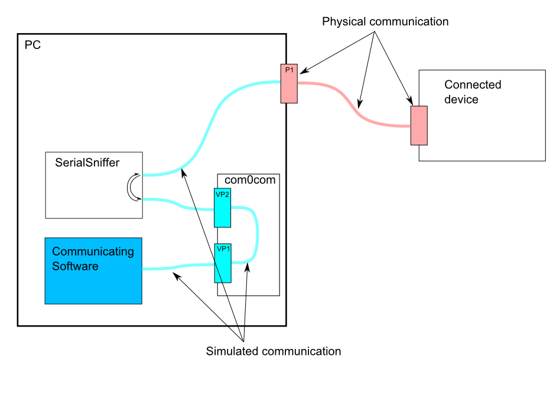

# SerialSniffer

A serial sniffer sits between two devices communicating through a serial channel, typically RS232C, and reads (sniffs) all the data interchanged between the devices. In this version, one of the devices must be a PC running .NET, typically a PC under Windows.



This solution relies on the well known **com0com** open source signed device driver available [here](http://com0com.sourceforge.net/).
that creates a virtual "null-modem" connection between two virtual serial ports on the PC. 

So the situation is as follows:

1. **com0com** installs two virtual ports **VP1** and **VP2** internally connected each other
2. The **Communicating Software**, that normally talks to the **Connected device** through a real **COM** port, is programmed to use the virtual port **VP1** instead
3. The **SerialSniffer** is connnected both to the virtual port **VP2** and to the real port **P1**.
   It relays all the data flowing in both directions. All data arriving from **VP2** (originating from the software) are transmitted to **P1**, all data arriving from **P1** are transmitted to **VP2** and then redirected to the softwre by com0com.
   Additionally, the sniffer stores this data into a log file.

***

Support for YCable

A support for a Ycable is now provided.
The command options are:

```
OPTIONS:                                                                                                                       
  -rx : the name of the virtual (connected via con0con) port or the port connected to RX line in -ycable mode. Mandatory.      
  -tx : the name of the real (connected to the device) port or the port connected to TX line in -ycable mode. . Mandatory      
  -output : the name of the file where the sniffed data will be stored. Mandatory                                              
                                                                                                                               
  -baud: baud rate with the real device. Optional, default 9600                                                                
  -parity: the parity of the communications. Optional, default to none                                                         
  -stopbit: the number of communicaiton stopbits. Optional, default to 1                                                       
  -data: Number of data bits. Optional, default is 8.                                                                          
  -onlyHex: Optional flag. If defined, then only the hex representation is generated.                                          
  -onlyAscii: Optional flag. If defined, then only the ASCII representation is generated.                                      
  -time: Optional flag. If defined, then the time when data arrives will be shown in the                                       
         YYYY-MM-DD HH:mm:ss.fff format                                                                                        
  -gui: Optional flag. If defined an interactive gui is shown                                                                  
  -ycable: Optional flag. If defined, a Y Cable is used, otherwise the com0com interface.                                      
  -bytesPerLine: Optional number of bytes shown per line. Default 16                                                           
  -collapsed: if true, then the successive packets from the same origin a re shown together. Optional, default false           
  -help: this help description                                                                                                 
The default format contains both hex and ascii and the time is shown as milliseconds elapsed                                   
since the first packet has been sniffed.                                                                                       
                                                                                                                               
EXAMPLE:                                                                                                                       
1. > SerialSniffer -rx COM1 -tx COM2 -baud 9600 -output sniffed.txt                                                            
```

   
Note
____

Download and use **com0com** version [2.2.2.0](https://sourceforge.net/projects/com0com/files/com0com/2.2.2.0/) as it is signed and works with any Windows version.
Version 3.0 is not working properly.
